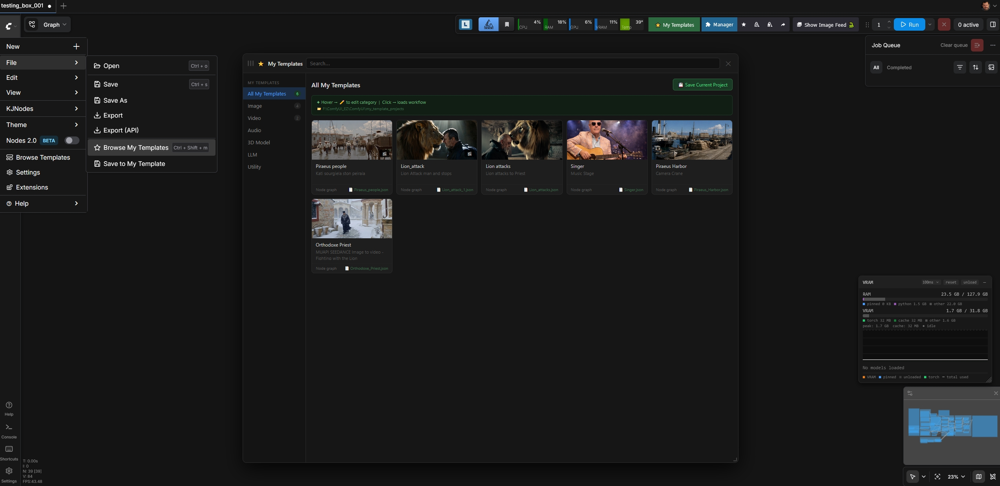

# ⭐ ComfyUI My Templates

Save, categorize and reload your own ComfyUI workflows as private templates — with image or short video thumbnails. Mirrors the look of the native Templates panel, but for **your** workflows.



---

## Features

- 💾 **Save current workflow** as a named template directly from the File menu
- 🖼️ **Image or video thumbnails** — videos are auto-trimmed to 3 seconds in the browser, played on hover
- 📂 **Categorize** templates: Image / Video / Audio / 3D / LLM / Utility
- 🪟 **Floating, draggable, resizable window** — position & size persist across sessions
- ⌨️ **Keyboard shortcut** `Ctrl+Shift+M` to toggle the window
- 📁 **Workflows saved as files** in `ComfyUI/my_template_projects/` — portable, easy to backup
- 🔍 **Live search** + click any card to load the workflow

## Access

After installation, three ways to open My Templates:

1. **⭐ My Templates** button in the top-right toolbar (next to Manager)
2. **File → Browse My Templates** menu item
3. Keyboard shortcut **Ctrl+Shift+M**

To save the current workflow:
- **File → Save to My Template**, or
- The **"Save Current Project"** button inside the My Templates window

---

## Installation

### Option 1 — ComfyUI Manager (recommended)

Search for `My Templates` in ComfyUI Manager and click Install.

### Option 2 — Manual

```bash
cd ComfyUI/custom_nodes
git clone https://github.com/trelohra-hash/comfyui-my-templates.git
```

Then restart ComfyUI and hard-refresh your browser (`Ctrl+Shift+R`).

The folder structure should look like:
```
ComfyUI/
├── custom_nodes/
│   └── comfyui-my-templates/
│       ├── __init__.py
│       ├── pyproject.toml
│       ├── LICENSE
│       ├── README.md
│       └── js/
│           └── my_templates.js
└── my_template_projects/        ← created automatically on first save
```

---

## How storage works

Each saved template produces up to three files in `ComfyUI/my_template_projects/`:

```
my_template_projects/
├── My_Portrait_LoRA.json   ← workflow graph
├── My_Portrait_LoRA.jpg    ← poster thumbnail (auto-extracted from video, or your image)
└── My_Portrait_LoRA.webm   ← optional 3-second video clip (only if you chose Video thumbnail)
```

Template metadata (name, description, category, dates) is stored in browser `localStorage`.
The actual workflows + thumbnails on disk are **portable** — zip the folder for backup or to move to another machine.

### Video thumbnails

Videos are **auto-trimmed to the first 3 seconds in your browser** using the native `MediaRecorder` API and saved as a small WebM clip (typically 300 KB – 1 MB). No FFmpeg or system dependencies required. The original video is never uploaded.

On hover over a card, the WebM clip plays on a 3-second loop.

---

## Compatibility

- ComfyUI: any recent version (uses official `app.registerExtension` API: `commands`, `menuCommands`, `keybindings`)
- Browser: Chrome, Edge, Firefox, Safari 14.1+

## License

MIT — see [LICENSE](LICENSE).
